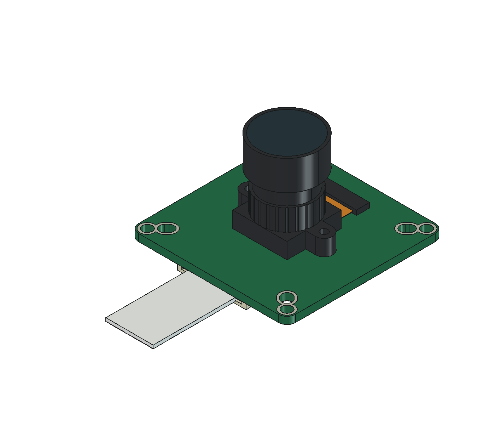
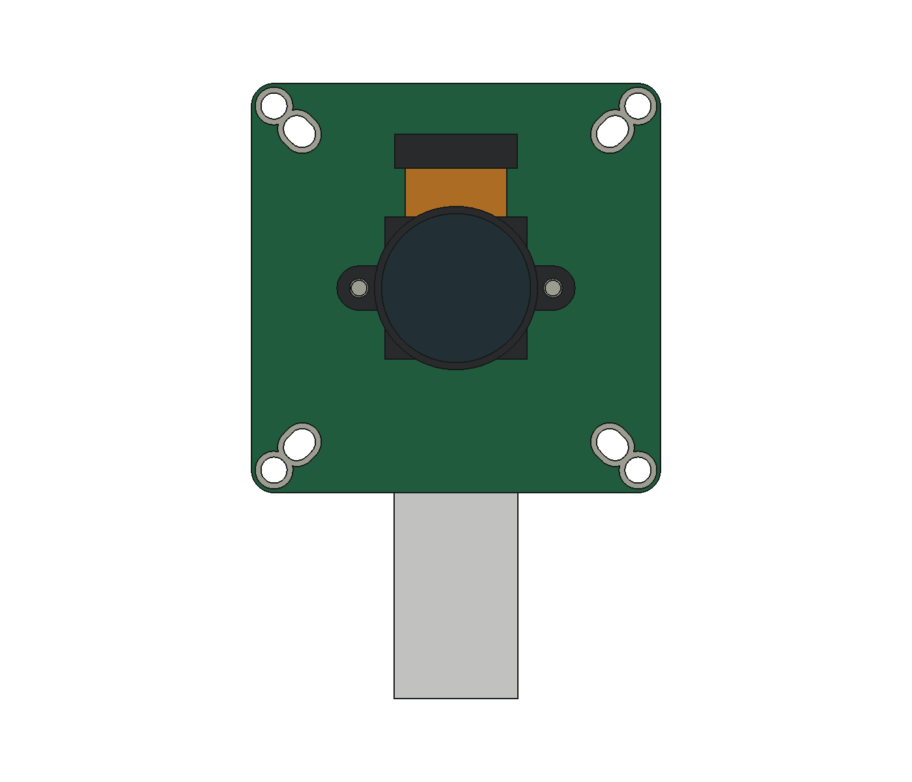
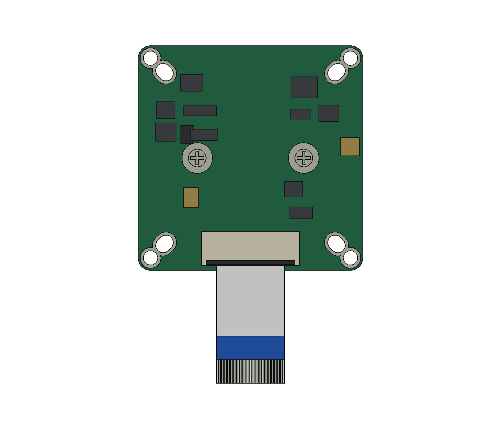
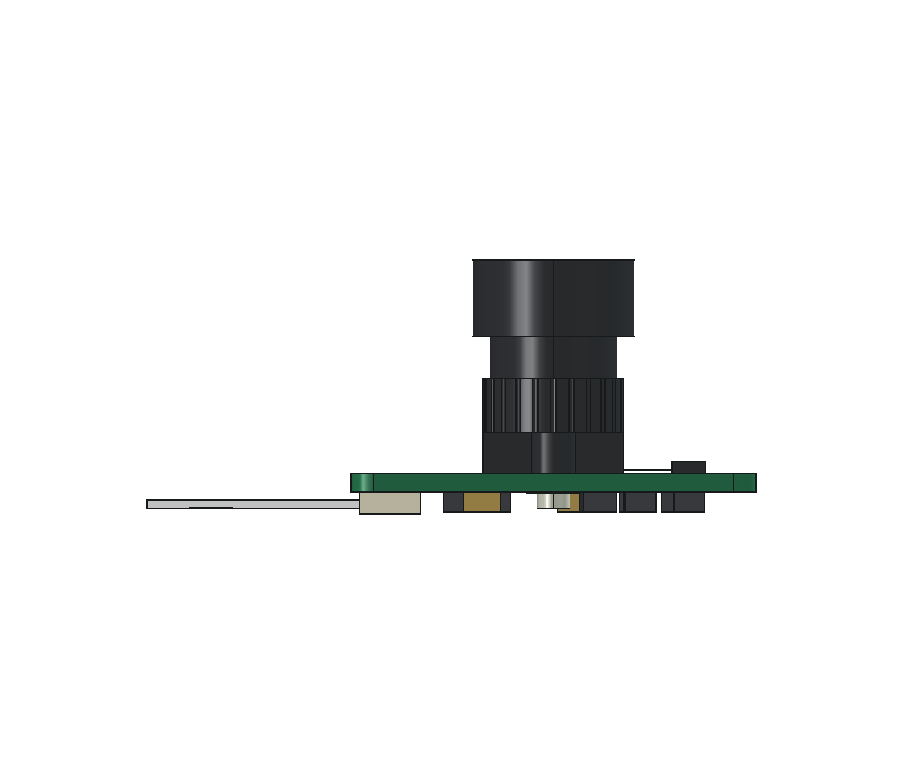
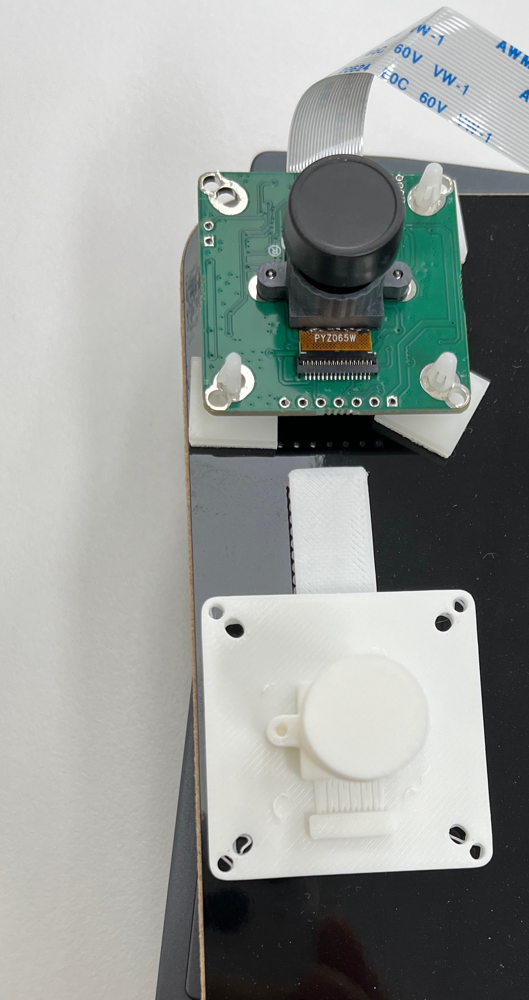
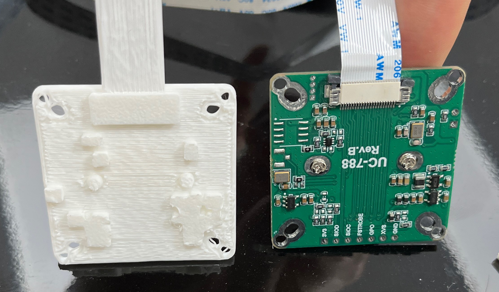
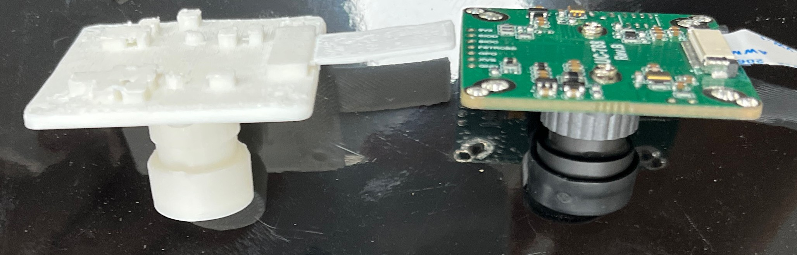

# OV9281 Camera Module 3D Reference Model

A measured mechanical model of an OV9281 camera module for enclosure design, cage mounting, and clearance checks in a four-camera motion-capture system. A printed model was compared with the real module before designing the housing.

## Model downloads

| Format | File |
| --- | --- |
| Editable FreeCAD model | [`FCStd`](cad/source/ov9281-camera-module.FCStd) |
| Printable model | [`STL`](models/stl/ov9281-camera-module.stl) |

Both files use millimetres. The PCB center is the XY origin, the rear PCB surface is Z=0, and the lens points in +Z.

## Rendered views

| Isometric | Front |
| --- | --- |
|  |  |

| Rear | Side |
| --- | --- |
|  |  |

## Physical size check

The printed model and actual camera are compared from the front, rear, and side.

| Front comparison | Rear comparison |
| --- | --- |
|  |  |

### Side and lens-height comparison

## Notes

- Check dimensions against your own module before fabrication; lens and cable configurations may differ.
- Small non-mounting PCB holes are filled for printability. The ribbon-cable envelope is reinforced to 0.80 mm and does not represent the actual cable thickness.
- This model is for mechanical fit checks, not manufacturer-certified production CAD.

## Related project

- [Four-Camera Motion-Capture System — Second Implementation](https://jaypark0115.github.io/jay-tech-notes/pages/planned/03-mocap-second-implementation.html)
- [Jay Tech Notes](https://jaypark0115.github.io/jay-tech-notes/)
